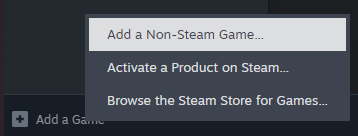
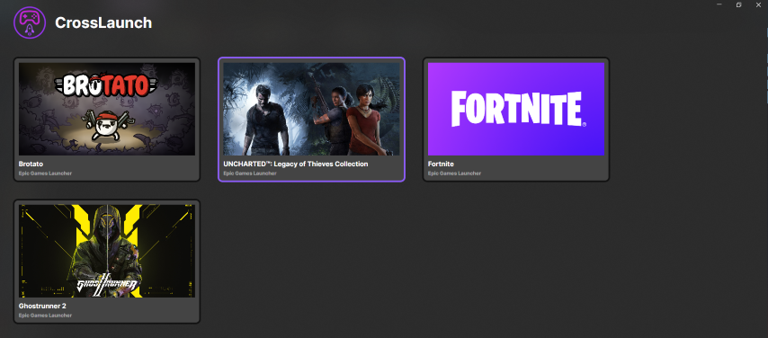

  <picture>
    <source media="(prefers-color-scheme: dark)" srcset="assets/img/CrossLaunch-Logo7.png" />
    <source media="(prefers-color-scheme: light)" srcset="assets/img/CrossLaunch-Logo4.png" />
    
  </picture>

# CrossLaunch

**Launch your games from various launchers through Steam**

CrossLaunch allows you to seamlessly launch games from various platforms directly through Steam. This means you can enjoy Steam's robust features—like controller support and the Steam Overlay—even when playing games from other launchers.

Prefer a standalone setup? CrossLaunch works independently of Steam too, offering a streamlined way to unify your game library for a simpler, more convenient gaming experience.

## Usage

1. Download the newest version archive from [GitHub Releases](https://github.com/DerStimmler/CrossLaunch/releases)
2. Extract the archive
3. In your Steam library, add the executable as a Non-Steam Game

   

      

          How to do that?
      

      
   | Add Non-Steam Game                                                              | Browse for executable                                                                      |
   |---------------------------------------------------------------------------------|--------------------------------------------------------------------------------------------|
   |  |  |
   

4. Start CrossLaunch through Steam by clicking _Play_
5. Select a game in the CrossLaunch launcher
   
    

## Supported Launchers

- Epic Games Launcher

## Troubleshooting

Log files are in `%LOCALAPPDATA%/CrossLaunch`.

## Development

1. Restore dotnet dependencies `dotnet restore`
2. Restore dotnet tools `dotnet tool restore`
3. Run app `dotnet run --project CrossLaunch`

- Format files `dotnet csharpier .`

## Shout-Out

Shout-Out to [EGDATA](https://egdata.app/), whose API is used to fetch the game images.
